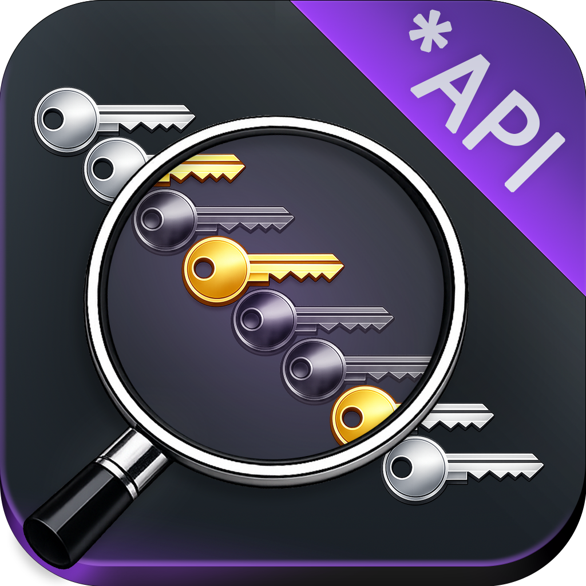
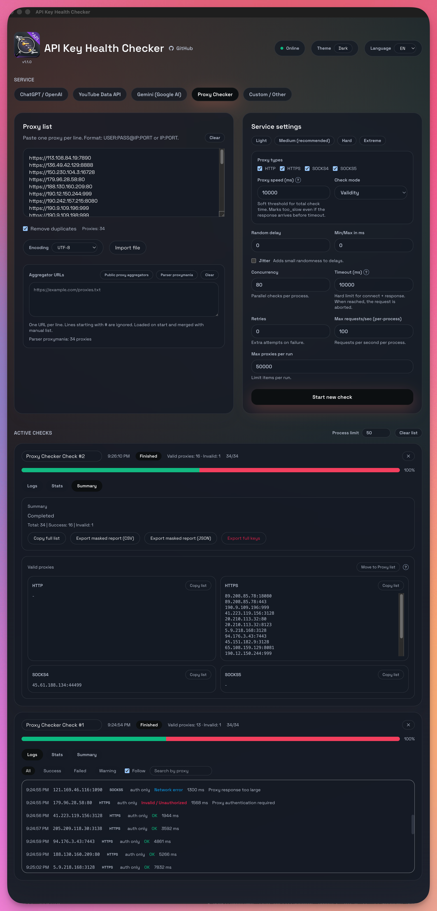

<p align="center">
  
</p>

# API Key Health Checker

GitHub: https://github.com/nbox/API-Key-Health-Checker

🌐 Читать на: [English](README.md) | [Русский](README.ru.md) | [Español](README.es.md)

Десктопное приложение для проверки API-ключей популярных сервисов и пакетных проверок с лимитами и отчетами. Поддерживает OpenAI (ChatGPT), Google Gemini, YouTube Data API и Custom эндпоинты.



## 🍺 Homebrew (macOS)

Установка:

```bash
brew install --cask nbox/tap/api-key-health-checker
```

Полное удаление данных:

```bash
brew uninstall --cask --zap api-key-health-checker
```

## Скачать

Релизы: https://github.com/nbox/API-Key-Health-Checker/releases

## macOS Gatekeeper

⚠️ macOS может блокировать неподписанные сборки, скачанные с GitHub. Если вы увидели сообщение "app is damaged and can't be opened. You should move it to the Trash", воспользуйтесь командой:

```bash
xattr -dr com.apple.quarantine "/Applications/API Key Health Checker.app"
```

## Возможности

- Адаптеры: OpenAI, Gemini, YouTube, Custom
- Пакетные проверки с параллельностью, случайной задержкой (jitter), ретраями, глобальным лимитом RPS
- Несколько параллельных запусков с логами в реальном времени, статистикой и сводкой
- Импорт ключей из TXT/CSV/JSON, выбор кодировки, дедупликация, предупреждения формата
- Экспорт отчетов в CSV/JSON (маскированный или полный)
- Языки UI: English (по умолчанию), Русский, Español

## Безопасность и приватность

- Ключи отправляются только в выбранный API
- Телеметрии нет
- Используйте только ключи, которыми вы владеете или имеете право пользоваться
- Полный экспорт сохраняет ключи в открытом виде (без шифрования). Используйте осторожно.

## Требования

- Node.js 20+
- npm

## Быстрый старт

```bash
npm install
npm run dev
```

## Сборка

```bash
git clone https://github.com/nbox/API-Key-Health-Checker.git
cd API-Key-Health-Checker
npm install
npm run build
npm run dist
```

Сборочные артефакты записываются в `dist/`.
DMG: `release/API Key Health Checker-1.0.0-{arch}.dmg`.
macOS: запускайте `npm run dist` на macOS — получите `.dmg` в `release/`.
Windows: запускайте `npm run dist` на Windows — получите установщик `.exe` в `release/`.

## GitHub Actions release

- При пуше в `main` или теге `v*`
- Сборка для macOS, Windows, Linux
- Создается GitHub Release с артефактами

## Пользовательский сервис

Используйте Custom адаптер, чтобы задать base URL, path, тип авторизации (bearer/header/query) и коды успешных ответов.

## Структура проекта

- `src/main`: основной процесс Electron и движок проверок
- `src/renderer`: UI (React + Tailwind)
- `src/shared`: общие типы и утилиты
